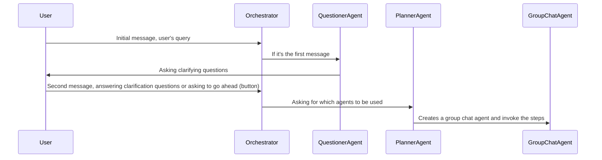
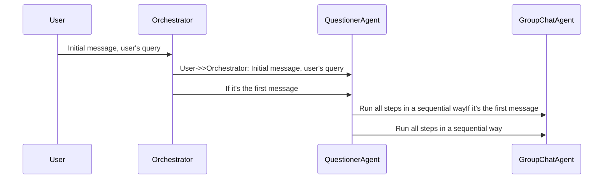
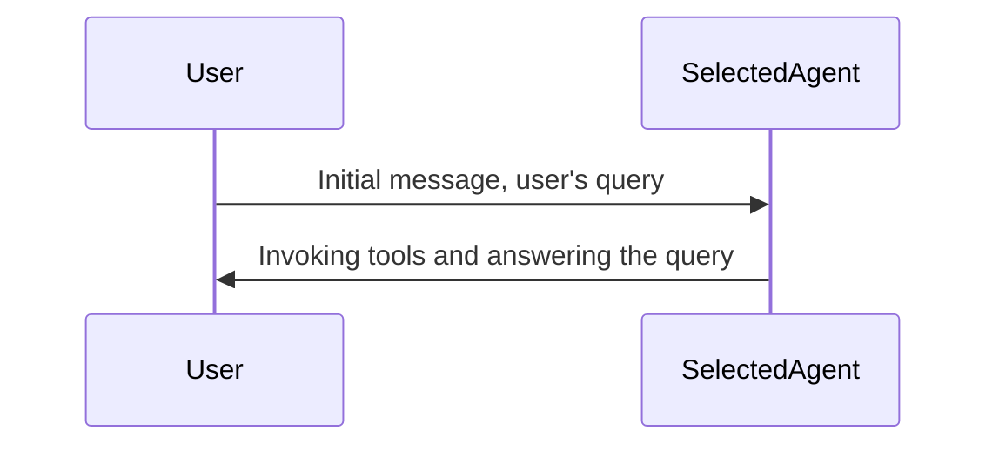

### Smart Flow

```mermaid
sequenceDiagram
    User->>Orchestrator: Initial message, user's query
    Orchestrator->>QuestionerAgent: If it's the first message
    QuestionerAgent->>User: Asking clarifying questions
    User->>Orchestrator: Second message, answering clarification questions or asking to go ahead (button)
    Orchestrator->>PlannerAgent: Asking for which agents to be used
    PlannerAgent->>GroupChatAgent: Creates a group chat agent and invoke the steps
```
---
### Deep Research Flow

```mermaid
sequenceDiagram
    User->>Orchestrator: Initial message, user's query
    Orchestrator->>QuestionerAgent: User->>Orchestrator: Initial message, user's query
    Orchestrator->>QuestionerAgent: If it's the first message
    QuestionerAgent->>GroupChatAgent: Run all steps in a sequential wayIf it's the first message
    QuestionerAgent->>GroupChatAgent: Run all steps in a sequential way
```
---
### Command Flow

```mermaid
sequenceDiagram
    User->>SelectedAgent: Initial message, user's query
    SelectedAgent->>User: Invoking tools and answering the query
```